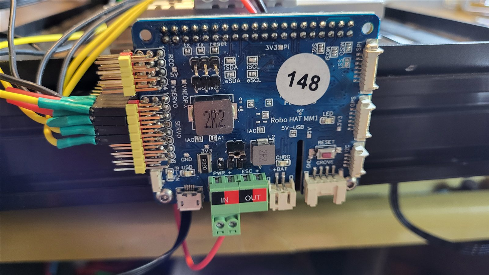
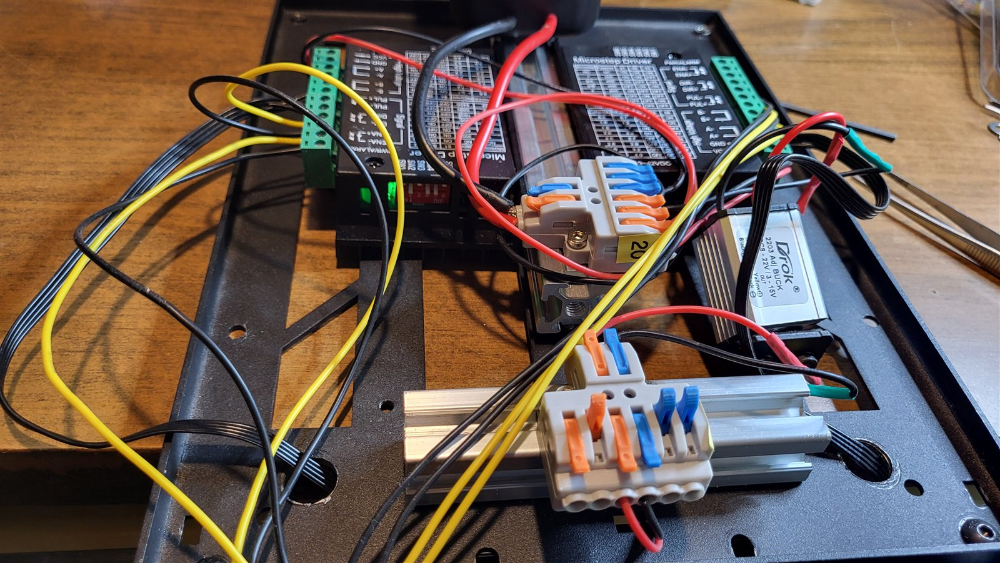
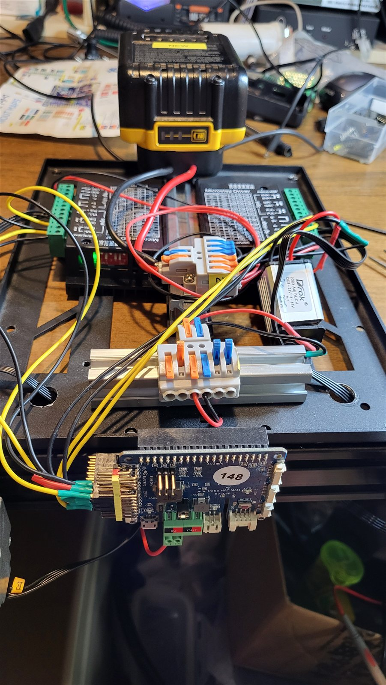

# RB4 (RomBot4) — robot en équilibre sur 2 roues

Robot auto-équilibré (pendule inversé) fabriqué par Roméo St-Cyr, septembre 2026.
L'équilibre est assuré par une carte **Robo HAT MM1** ; un **Raspberry Pi 3** monté dessus
sert une page web pour piloter le robot, voir la caméra et ajuster les réglages en direct.

## Matériel

| Élément | Détails |
|---|---|
| Contrôleur d'équilibre | Robo HAT MM1 (SAMD51), monté en HAT sur le Pi 3, IMU MPU9250 intégrée |
| Ordinateur de bord | Raspberry Pi 3 modèle B, Raspbian 11 (Bullseye) 32 bits |
| Drivers | 2 × TB6600, micropas 1/8 (1600 pas/tour), 1,5 A |
| Moteurs | 2 × NEMA17 BJ42D41-05V01, roues de 82 mm |
| Batterie | Dewalt 20 V (TB6600 en direct, MM1 par un convertisseur 12 V) |
| Caméra | Caméra USB Innomaker U20CAM-1080p (ou caméra du Pi) |

Câblage MM1 → TB6600 : SERVO1 → PUL+ gauche, SERVO2 → DIR+ gauche, SERVO3 → PUL+ droit,
SERVO4 → DIR+ droit (broches jaunes) ; broches noires → PUL− et DIR−.
**Ne jamais brancher les broches rouges**, ni la batterie 20 V sur l'entrée IN du MM1 (7 à 14 V).

## Contenu du dépôt

| Dossier | Contenu |
|---|---|
| `RBBB_equilibre_v19/` | Programme Arduino du MM1, version 1.9 |
| `pi_web/` | Serveur web du Pi version 1.9 (`rbbb_web.py`, Flask) et page de commande (`index.html`), service systemd, script de coupure, outils d'analyse |
| `modele/` | Modèle du pendule, identification et essais de réglages (`balayage.py`) |
| `photos/` | Photos du montage |

La version 1.9 ajoute une rampe de freinage réglable (`b`). Elle compile, mais n'a pas encore
été essayée sur le robot ; avec `b 0`, elle se comporte comme la version 1.8 validée.

## Photos

| Robo HAT MM1 | TB6600 et convertisseur 12 V | Vue d'ensemble |
|---|---|---|
|  |  |  |

## Principe

- Le MM1 produit les impulsions des moteurs pas-à-pas par une interruption de minuterie à
  50 kHz et régule l'équilibre 200 fois par seconde (filtre complémentaire gyroscope +
  accéléromètre). La régulation commande une **accélération** des roues.
- Une boucle de vitesse extérieure (KV, KI) penche légèrement le robot pour le ramener à
  l'arrêt ou le faire avancer sur commande.
- Le Pi et le MM1 se parlent par le port série du connecteur 40 broches (`/dev/serial0`,
  115200 bauds). Le Pi envoie `m <vitesse> <virage>` 10 fois par seconde et les réglages
  (`p`, `d`, `v`, `a`, `f`, `i`, `e`, `r`, `b`) ; le MM1 renvoie son état (lignes `E`) et
  ses réglages (lignes `R`). Sans nouvelles du Pi pendant 0,5 s, le MM1 s'arrête sur place.

## Installation

**MM1** : dans l'IDE Arduino, ajouter l'URL de cartes
`https://raw.githubusercontent.com/robotics-masters/mm1-hat-arduino/master/custom_board/package_robohat_index.json`,
installer « Arduino SAMD Boards » et « Robo HAT Boards », choisir la carte
**Robo HAT MM1 (SAMD51)**, puis téléverser le programme par le micro-USB du MM1.
Coucher ou tenir le robot pendant le téléversement.

**Pi** : copier le contenu de `pi_web/` dans `/home/rj/rbbb_web/`, installer Flask et pyserial,
puis :

```
sudo cp rbbb-web.service /etc/systemd/system/
sudo systemctl enable --now rbbb-web
sudo install -m 755 rbbb-coupure /lib/systemd/system-shutdown/
```

Dans `/boot/config.txt` : `enable_uart=1` et `dtoverlay=disable-bt` ; retirer
`console=serial0,115200` de `/boot/cmdline.txt`. Ne pas activer l'I2C du Pi (il partage le
bus de l'IMU du MM1).

La page de commande est alors à l'adresse `http://<adresse du Pi>:8000`.

## Licence

Code publié sous licence MIT (voir `LICENSE`).
